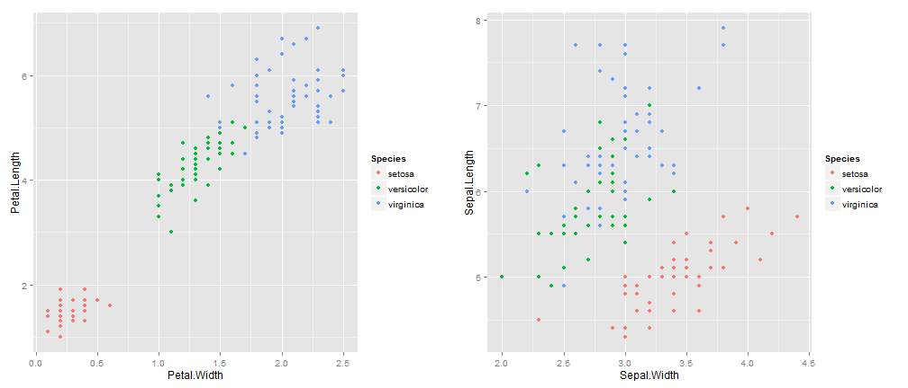

---
title       : Species Prediction Algorithm
subtitle    : A shiny app to predict flower species
author      : 
job         : 
framework   : io2012       # {io2012, html5slides, shower, dzslides, ...}
highlighter : highlight.js  # {highlight.js, prettify, highlight}
hitheme     : tomorrow      # 
widgets     : []            # {mathjax, quiz, bootstrap}
mode        : selfcontained # {standalone, draft}
knit        : slidify::knit2slides
---  


## Introduction  

This app will predict the species of a flower based on its sepal length and width 
and petal length and width in centimeters. This is done based on a prediction algorithm 
trained on the IRIS dataset,with linear discriminant analysis 
method and train function from the caret package.  

The  iris data set gives the measurements in centimeters of the variables sepal length and width and petal length and width, respectively, for 50 flowers from each of 3 species of iris. The species are Iris setosa, versicolor, and virginica.  

Consequently, any new flower will be fit into one of the three species.  

--- .class #id
  

## Exploratory Analysis    


 
   
   
The plots display Species by Sepal width + length and Petal width + length combination. showing high correlation between these measurements and the species. These variables can be used in prediction model. 


--- .class #id


## Prediction Algorithm

Prediction will be done using Linear Discriminant Analysis. The table below shows the result of prediction vs actual Species on the test data set. The accuracy rate of prediction is high.


```
##             
## pred         setosa versicolor virginica
##   setosa         15          0         0
##   versicolor      0         15         0
##   virginica       0          0        15
```
  
  
### To classify a new flower, its measurements have to be plugged into the model   

For example:  
Sepal.Length=5.0,Sepal.Width=3.0,Petal.Length=1.0,Petal.Width=0.5

```r
predict(modelfit, data.frame(Sepal.Length=5.0, Sepal.Width=3.0,Petal.Length=1.0,Petal.Width=0.5))
```

```
## [1] setosa
## Levels: setosa versicolor virginica
```


--- .class #id

## Shiny App
 
The shiny app below, will classify a flower based on the measurements entered by the user, using
the prediction algorithm described.

https://hiranmayv.shinyapps.io/SpeciesPrediction 
  
The code is available in ui.R and server.R files available at :
https://github.com/hiranmayv/DevelopingDataProducts
